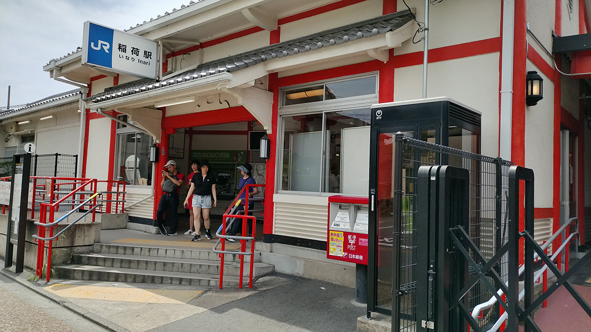
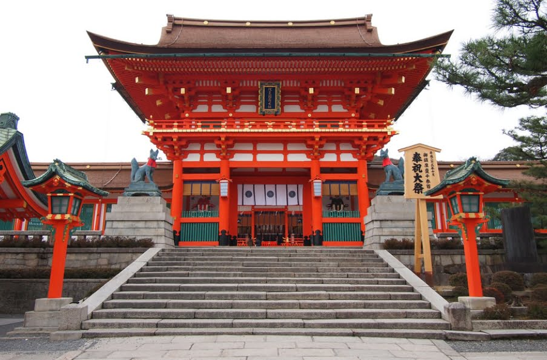
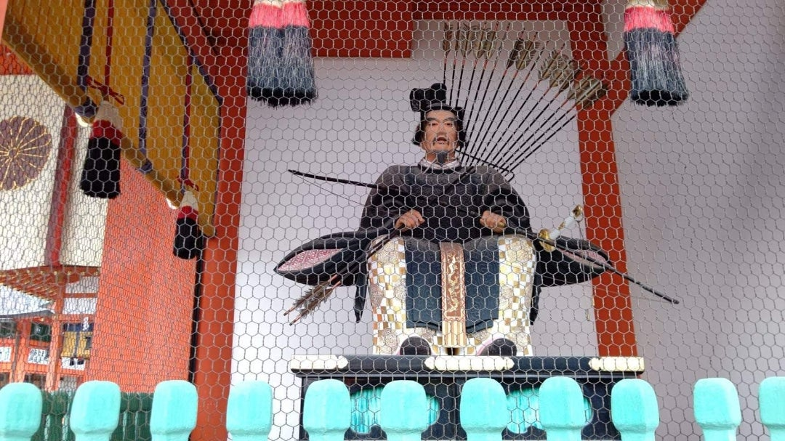

# 🦊 伏見稲荷大社 富裕層向けプライベートナイトツアー ガイドマニュアル
## ～静寂と霊気の2時間、千本鳥居の深層へ～

---

> **ガイドの使命**
> 単なる「解説者」ではなく、ゲストと日本の精神文化を繋ぐ**コンシェルジュ兼ストーリーテラー**として振る舞う。
> 混雑を避け、伏見稲荷の本質と美学を凝縮してお届けすること。

---

## 📋 ツアー基本情報

| 項目 | 内容 |
|------|------|
| **所要時間** | 約2時間 |
| **実施場所** | 京都・伏見稲荷大社（夜間） |
| **集合場所** | JR稲荷駅 改札前（改札は1つのみ） |
| **解散場所** | JR稲荷駅前 |
| **ツアーコンセプト** | 混雑を避け、幻想的な夜の稲荷を凝縮体験 |
| **ターゲットゲスト** | 欧米・アジアの富裕層（本質的体験・静寂・ストーリーを重視） |

---

## ⚠️ 出発前の重要注意事項

### 安全管理
- **夜間の足元確認**：参道・山道は暗く傾斜があるため、ガイドは必ず先頭を歩き、足元の安全を常に確認すること
- **熱中症対策**：夏場はこまめな水分補給を推奨。ガイド自身も率先して日陰での休憩を取り、ゲストへも促すこと
- **雨天時**：山道は非常に滑りやすくなるため、雨天用スケジュールに従う（おもかる石付近で引き返し、最初の説明に時間を多く割く）
- **イノシシ出没注意**：稲荷山では夜間（日没〜深夜）のイノシシ出没が報告されている。万一遭遇した場合は「慌てずゆっくり離れ、目を合わせず急に動かない」こと。追いかけず、餌を与えず、子連れには絶対に近づかない

### 会話設計
- 山道でも会話が途切れないよう、事前にトピックを複数準備しておくこと
- スポットごとに滞在時間の目安を口頭でアナウンスする
- ゲストの関心（歴史重視 / 写真重視 / 両方）を最初に確認する

---

## 🗓️ タイムライン概要

| 時刻 | 場所 | 内容 |
|------|------|------|
| 17:00–17:05 | JR稲荷駅 | 集合・自己紹介・ツアー概要説明 |
| 17:05–17:30 | 楼門・本殿エリア | 歴史解説・神様紹介・作法体験 |
| 17:30–17:40 | 千本鳥居 入口 | 鳥居の意味・奉納文化の解説 |
| 17:40–17:50 | 奥社奉拝所 | おもかる石体験・お塚信仰の解説 |
| 18:10頃 | 新池（Shinike） | 霊的な池の解説・リフレクション撮影 |
| 18:30頃 | 四ツ辻展望台 | 展望と休憩・茶屋案内 |
| 18:30–18:50 | 下山 | 夜景・提灯の雰囲気を楽しむ |
| 18:50 | JR稲荷駅 | 解散・フォローアップ |

---

## 📍 スポット別 ガイドスクリプト

---

### 1️⃣ 17:00–17:05｜集合・ツアー概要説明（JR稲荷駅）

**ウェルカム**

JR稲荷駅でゲストを笑顔で迎え、英語で自己紹介を行う。

**説明内容**
- ツアーの概要（徒歩約1時間以上、山道・階段あり）
- ゲストの体力に合わせて途中休憩が可能であることを説明
- コンビニでの水分補給・暑さ対策グッズ購入の案内
- ゲストの関心を確認（歴史重視 / 写真重視 / 両方）
- **ライトの手渡し**（夜間のため必須）

> 💬 **ガイドの一言例：**
> *"Tonight, we'll experience Fushimi Inari in a way most visitors never see — without the crowds, under lantern light, in the company of 1,300 years of history."*

---

### 2️⃣ 17:05–17:30｜楼門・本殿エリア

#### 🏯 歴史背景

- **創建：** 西暦711年（奈良時代・和銅4年）
- **地位：** 全国約3万社の稲荷神社の**総本社**
- 創建者は秦氏ゆかりの伊呂具秦公。稲荷山の三峰に神を祀ったことが始まり

#### ⛩️ 楼門

- **再建者：** 豊臣秀吉（安土桃山時代）
- **高さ：** 約7メートルの朱色の門
- 門の両脇に立つ像は**随身（ずいしん）**。もとは貴族・天皇家のボディガードであり、武士の時代に神格化されて聖域を守る象徴として配置されるようになった。東大寺南大門の金剛仁王像と役割は同じ

#### 🦊 狐像の解説

狐は稲荷大神の**眷属（使い）**。口に咥えるアイテムにはそれぞれ意味がある：

| アイテム | 意味 |
|----------|------|
| 稲穂 | 五穀豊穣 |
| 鍵 | 米蔵・穀物蔵の鍵（稲穂と同義） |
| 玉（宝珠） | 神社の権威・宝 |
| 巻物 | 知識・神社の権威 |

#### 🌊 手水舎（てみずや）

参拝前に手を清める場所。手洗いの作法を丁寧に案内する。

#### 🏛️ 外拝殿（げはいでん）

- 江戸時代末期（天保11年・1840年）建立の**国の重要文化財**
- 檜皮葺（ひわだぶき）の美しい屋根
- 稲荷祭の神輿を並べ、神楽や奉納舞踊の舞台として使用。参拝者が祈る場所というよりも**神事の舞台**
- **星座の灯籠：** メソポタミア→インド→中国経由で日本に入った暦・占星術の名残。寺院に星座の曼荼羅を配置する場所はあるが、灯籠に星座だけを刻むのは非常に珍しい

#### 🙏 本殿（ほんでん）

**神社作法（二礼二拍手一礼）の体験を案内する**
※現在、鈴は取り外されている

**稲荷大社に祀られている神々（五柱）：**

| 神名 | 祀られる位置 | 御神徳 |
|------|-------------|--------|
| 宇迦之御魂大神（うかのみたまのおおかみ） | 下社・中央座（主祭神） | 穀物・五穀豊穣・産業繁栄 |
| 佐田彦大神（さたひこのおおかみ） | 中社・北座 | 交通・導き |
| 大宮能売大神（おおみやのめのおおかみ） | 上社・南座 | 商業・芸能 |
| 田中大神（たなかのおおかみ） | 下社摂社・最北座 | 農業・土地 |
| 四大神（しのおおかみ） | 中社摂社・最南座 | 諸産業 |

> 💬 **ゲストへの語りかけ例：**
> *"These five deities represent everything from the rice in the fields to the success of a merchant's business. For over 1,300 years, people have come here with their deepest hopes."*

#### 🎴 絵馬と鳥居型絵馬

- **絵馬の起源：** 奈良時代、神様に生きた馬を奉納する風習（御神馬）から始まった。生きた馬を奉納できない代わりに木や紙に馬の絵を描いて奉納するようになり、神馬舎（馬小屋）の形が「家型絵馬」へと発展
- **家の形の理由：** 神社の社殿（神の家）を模した形であり、家内安全・家族の繁栄を祈る文化的意味を持つ
- 伏見稲荷では独特の**鳥居型絵馬**も奉納される

> ※神社と仏閣の違いなどの説明は、ゲストの質問がない限りここでは控え、後半の散策中の話題として確保する

---

### 3️⃣ 17:30–17:40｜千本鳥居 入口

#### 🔢 鳥居の数

- 通称「千本鳥居」だが、**稲荷山全体では約10,000基**が奉納されている
- 千本鳥居エリアは約800基、稲荷山全体では3,000基以上

#### 📜 奉納の文化

- **江戸時代末期以降**に広まった文化（約200年の伝統）
- 鳥居の裏面には**奉納者の名前と日付**が刻まれている
- 奉納の意味：願い事が「通る」または「通った」御礼として行われる
- 鳥居の寿命は**約4〜5年**。古くなると新しく交換される
- 費用の目安：小さな鳥居で**約20万円〜**、最大サイズで**約130万円**

#### 🎨 朱色の意味

| 意味 | 説明 |
|------|------|
| **魔除け・災厄除け** | 古代より丹色は魔を払う呪術的な力を持つとされる |
| **太陽・火の象徴** | 古代日本人が太陽を神として崇め、生命の躍動を朱色に込めた |
| **防腐・防虫効果** | 丹色の原料「辰砂（硫化水銀）」が木材の劣化を防ぐ実用的効果も |
| **錬丹術の影響** | 中国の錬丹術由来で、毒をもって魔を祓う信仰的意味も含む |

#### 🗼 鳥居の形の意味

- **笠木（かさぎ）：** 最上部の屋根状横木。天を表す。軽く反った曲線が特徴
- **島木（しまぎ）：** 笠木の直下の水平な横木。構造的強度を担う。地を象徴
- **柱：** 神域と俗界の境界を示す。「鳥居」の語源は「鳥が止まる場所」＝神の使いである鳥が集まる場所
- 形全体が**神と人の世界の境界線**を表している

> 💬 **写真スポットについて：**
> ここでゲストが写真を撮りたがるが、**上の方が人が少なくより良い写真が撮れる**ことを案内する。ただし日が沈んでいる場合は暗くて撮りにくい可能性も踏まえて伝えること。

---

### 4️⃣ 17:40–17:50｜奥社奉拝所（おもかる石）

#### 🪨 おもかる石の体験

1. 願い事を念じながら石灯籠の頭部（石）を持ち上げる
2. **軽く感じたら**→願いが叶う兆し
3. **重く感じたら**→もう少し努力が必要

ゲストに一人ずつ体験してもらい、感想を聞く。

> ☀️ **休憩の合図：** 特に夏場は体力消耗が激しいため、ここで必ず様子を伺い休憩を取ること

#### ⛩️ お塚（おつか）信仰

- **お塚とは：** 個人や企業が稲荷神社内に私的に設けた小さなお社・祠・石碑のこと
- 稲荷山には**約10,000基以上**のお塚が存在する
- 本殿の神様とは別の「自分のおいなりさん」を祀る、**個人信仰の形**
- 起源は江戸時代後半〜明治時代にかけて活発化。最初は「木の枝を盛り土に突き立てる」ような簡素な形から始まり、やがて石碑・石像に発展
- 神社側も最初は黙認していたが、大正12年頃から新設禁止の方針が出され、昭和37年（1962年）に許可制に移行
- 現在も参道の手入れは信者や管理者が担っている

> 💬 **ゲストへの語りかけ例：**
> *"Unlike official shrines, these small stone monuments were built by ordinary people — merchants, farmers, families — who wanted their own personal connection to the divine. It's faith in its most intimate form."*

---

### 5️⃣ 18:10頃｜新池（Shinike）

- 奥社からさらに進んだ場所にある、静けさに包まれた神聖な池
- 古来より**霊力の宿る場所**とされてきた
- **鳥居と水面のリフレクション**が美しい写真スポット
- 夜間のライトに照らされた幻想的な雰囲気を楽しんでもらう

> ☀️ **休憩の合図：** 特に夏場は体力消耗が激しいため、ここで必ず様子を伺い休憩を取ること

---

### 6️⃣ 18:30頃｜四ツ辻（よつつじ）展望台・茶屋

- 京都市街が一望できる**絶景ポイント**として紹介するが、実際に見えるのは主に**西側の景色**（京都市内の建物は見えない）
- 写真撮影と休憩の絶好の場所
- 茶屋があり、必要に応じて軽食・飲み物を案内できる

> ☀️ **休憩の合図：** 特に夏場は体力消耗が激しいため、ここで必ず様子を伺い休憩を取ること

---

### 7️⃣ 18:30–18:50｜下山・夜の参道

- 千本鳥居の道を戻りながら下山
- 夜景や提灯の幻想的な雰囲気を十分に楽しんでもらう
- 下山中も会話を途切れさせず、**散策中の話題**（下記参照）を活用する

---

### 8️⃣ 18:50｜解散・フォローアップ（JR稲荷駅）

**クロージングの流れ**

1. ツアー全体の振り返りとハイライトを共有
2. ガイドからの感謝の言葉を丁寧に伝える
3. ゲストの希望に応じて以下を案内：
   - 京都のおすすめレストラン・バー・観光スポット
   - **JR稲荷駅横のデイリーヤマザキ**で伏見稲荷グッズが販売中
4. 写真撮影の依頼には快く応じ、思い出づくりをサポート
5. **ライトの回収**を忘れずに行う
6. ツアー終了の報告を送る

> 💬 **締めの一言例：**
> *"Thank you for walking with me tonight. What you experienced here tonight — the silence, the lights, the ancient stories — is something very few visitors ever get to feel. I hope it stays with you."*

---

## 💬 散策中に挿入する話題集（適宜使用）

### 📖 稲荷信仰の変遷：農業から商売繁盛へ

**なぜ「農業の神」が「ビジネスの神」になったのか？**

1. **創建当初（711年）：** 秦氏が稲荷山に神を祀り、五穀豊穣を祈願する農耕信仰
2. **江戸時代：** 江戸の商人たちが稲荷信仰を取り入れ始め、「米が通貨として機能する時代」に五穀豊穣＝財運・商売繁盛へと転化
3. **現代：** 資本主義の発展とともに商工業全般の守護神として全国に広まり、日本最多クラスの信仰を集める

> 💬 *"In a way, Inari is the god that has always kept up with the times — from rice fields to trading houses, and now to modern corporations. There are CEOs in Tokyo who come here every year."*

### ⛩️ 神社と仏閣の違い（神仏習合）

- **神社：** 日本固有の神道の場。神様（自然の力・先祖の霊）を祀る
- **仏閣：** 仏教の場。仏様・菩薩を祀る
- 明治時代の神仏分離令（1868年）以前は、神社と寺が混在する「神仏習合」の状態が約1000年以上続いていた
- 伏見稲荷でも、かつては仏教的な要素（稲荷大明神・荼枳尼天）が融合していた

### 🎯 ゲストとの個人的な会話

- 日本で訪れた場所で最も印象に残ったところは？
- 自国に似たような聖地・信仰の場所はある？
- 旅の中で最も感動した国や体験は？

---

## 🌧️ 雨天時の対応プロトコル

| 状況 | 対応 |
|------|------|
| 小雨 | 傘・レインコート確認後、通常ルートで慎重に進む |
| 強雨 | **おもかる石（奥社奉拝所）付近で引き返す** |
| 引き返す際の説明 | *"For your safety, the mountain path beyond this point becomes very slippery in the rain. We'll spend more time here and in the main shrine area instead."* |
| 時間調整 | 最初の楼門・本殿エリアの説明に時間を多く取り、ゆっくりとした体験を提供する |

---

## 🎌 伏見稲荷大社 年間主要祭礼カレンダー

ゲストから祭りについて質問された際に活用すること。

| 月 | 主な祭礼 | 日程（目安） |
|----|---------|------------|
| 2月 | **初午大祭** | 初午の日（2026年：2月1日） |
| 4月 | **稲荷祭・神幸祭**（最重要） | 4月20日近くの日曜（2026年：4月19日） |
| 4月 | 産業祭 | 4月5日頃 |
| 5月 | 稲荷祭・還幸祭 | 5月3日頃 |
| 6月 | 田植祭 / 大祓式 | 6月上旬 / 6月30日頃 |
| 7月 | **本宮祭**（境内に無数の提灯・最大規模） | 土用入後の日曜 |
| 11月 | 新嘗祭 | 11月23日 |
| 12月 | 大祓式 | 12月31日 |

> **ガイドのおすすめ：** 本宮祭（7月）は境内・参道に無数の提灯が並び、夜に赤く染まる光景が圧巻。ナイトツアーとの相性が最高

---

## 🦗 緊急時・特殊事態の対応

### イノシシ出没時の対応

1. **慌てずにゆっくり離れる**
2. 目を合わせず、急に動かない
3. 大声・手拍子で威嚇（それでも近づく場合は木や岩を盾に）
4. 子連れには絶対に近づかない
5. 高所（段差・岩場）に上がって距離を取る
6. けがをした場合：119（救急）または110（警察）に連絡

> **夜間の推奨：** 稲荷山は21〜22時までに下山するのが安全

### その他の緊急事態

- ゲストの体調不良→すぐに休憩を取り、状況に応じてツアーを中断
- 道迷い→四ツ辻・奥社などの主要ポイントを目印に戻る

---

## 📝 ガイドのための心得

> **プロフェッショナルとして**
> - ゲストの感情・反応を常に読み取り、話すスピード・深さを調整する
> - 「解説」ではなく「体験」を届けることを意識する
> - 沈黙も「体験の一部」として大切にする
> - 写真撮影のサポートを積極的に行う

> **コンシェルジュとして**
> - ツアー後のレストラン・観光情報を常に最新化しておく
> - ゲストの旅程全体に関心を持ち、京都・日本をより深く楽しむためのアドバイスを提供する

---

*最終更新日：2025年*
*© GOKU TRIP 株式会社 — スタッフ内部資料 / 無断転載禁止*
